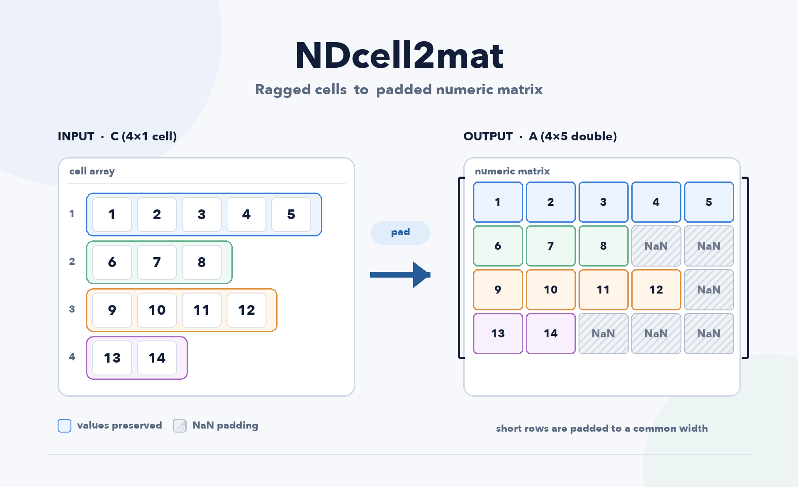

<p align="center"></p>

<h1 align="center">NDcell2mat</h1>

<p align="center"><strong>Pads a ragged (jagged) MATLAB cell array, of any container shape or dimension, into one dense numeric matrix.</strong></p>

<p align="center">
<a href="https://www.mathworks.com/matlabcentral/fileexchange/94240-ndcell2mat"></a>
<a href="LICENSE"></a>
<a href="https://github.com/domattioli/NDcell2mat/actions/workflows/ci.yml"></a>
<a href="https://github.com/domattioli/NDcell2mat/releases"></a>
</p>

## Table of contents

- [Status](#status)
- [The problem](#the-problem)
- [Install](#install)
- [Usage](#usage)
- [Arguments](#arguments)
- [How the output is shaped](#how-the-output-is-shaped)
- [NDcell2mat vs. cell2mat vs. padcat](#ndcell2mat-vs-cell2mat-vs-padcat)
- [Limitations](#limitations)
- [Testing](#testing)
- [Equivalent in Python](#equivalent-in-python)
- [Contributing](#contributing)
- [License](#license)

## Status

Version 1.0.0 marks a documentation and packaging update, not a functional change to the underlying algorithm, which has been stable since the function's first File Exchange release in 2021.

## The problem

`cell2mat` requires every cell to hold contents of matching, congruent size; a cell array with vectors of different lengths errors. `NDcell2mat` accepts that ragged input directly and pads the short entries with a filler value.

```matlab
C = { [0]; [1 2 3]; [4; 5]; NaN; [6 7 8 9 10] };
M = NDcell2mat( C )
```

```
M =

     0   NaN   NaN   NaN   NaN
     1     2     3   NaN   NaN
     4     5   NaN   NaN   NaN
   NaN   NaN   NaN   NaN   NaN
     6     7     8     9    10
```

`cell2mat( C )` on the same input raises `Error using cell2mat ... Dimension mismatch for CAT2.`

## Install

Pick one:

1. **File Exchange** — install from the [File Exchange listing](https://www.mathworks.com/matlabcentral/fileexchange/94240-ndcell2mat) via the Add-Ons Explorer.
2. **Toolbox file** — download the `.mltbx` from [Releases](https://github.com/domattioli/NDcell2mat/releases) and double-click to install.
3. **Clone** — `git clone https://github.com/domattioli/NDcell2mat.git` and `addpath` the resulting directory.

## Usage

```matlab
M = NDcell2mat( C );      % pad with NaN (default)
M = NDcell2mat( C, V );   % pad with a chosen filler value V
```

## Arguments

| Name | Type | Default | Description |
|---|---|---|---|
| `C` | cell array, any dimension, numeric contents | — (required) | Cell contents may vary in size; each element's contents are linearized before being written into the output. |
| `V` | numeric scalar | `NaN` | Filler value for the padded positions. A char/string `V` is coerced with a warning (`'NaN'`, `'Zeros'`, `'Inf'`, or a numeric-looking string); any other non-numeric, non-char `V` is silently coerced to `Inf`. |
| `M` | numeric matrix | — | Output. |

## How the output is shaped

`NDcell2mat` finds the first singleton dimension of `C` and lays each cell's linearized contents along it. Output size equals `size(C)` with that dimension replaced by the largest element count across all cells (`max(cellfun(@numel, C))`).

```matlab
C = { 0, [1,2,3]; [4;5], NaN; [6,7,8,9], Inf };
M = NDcell2mat( C, Inf )
```

`C` is 3×2; its first singleton dimension does not exist in either explicit dimension, so `NDcell2mat` grows a new trailing dimension sized to the largest cell (4 elements), producing a 3×2×4 array.

## NDcell2mat vs. cell2mat vs. padcat

| | Ragged input | Container shape | Filler |
|---|---|---|---|
| `cell2mat` | Errors | any | — |
| [`padcat`](https://www.mathworks.com/matlabcentral/fileexchange/22909-padcat) | Pads | 1-D/2-D vectors only | `NaN`, fixed |
| `NDcell2mat` | Pads | any N-D cell array | any numeric scalar |

Reach for `cell2mat` when the contents are already congruent. Reach for `padcat` for a flat list of 1-D vectors when its index outputs are useful. Reach for `NDcell2mat` when the cell array itself has more than one dimension, or the filler needs to be something other than `NaN`.

## Limitations

- Cell contents must be numeric. Logical-content cells are rejected; convert first with `cellfun(@double, C, 'UniformOutput', false)`.
- An empty cell array (`C = {}`) currently errors rather than returning an empty result. This is a known, undecided defect, not a documented feature.
- A non-double numeric filler (e.g., `int8(0)`) forces the output matrix to that integer class, which saturates rather than overflowing.
- Octave compatibility: verified under GNU Octave 11.3.0 (`isstring`, the one MATLAB-R2016b-only builtin in the filler-coercion branch, is present in Octave and behaves equivalently). See `tests/octave_smoke.m`, run in CI alongside the MATLAB suite.

## Testing

```matlab
runtests( 'tests' )
```

## Equivalent in Python

No single well-established PyPI package covers this exact case (an N-dimensional container of ragged numeric arrays, padded to a dense array with a chosen fill value); `awkward-array` comes closest but adds a dependency most users padding a short list would not otherwise need. See [`PORTS.md`](PORTS.md) for a NumPy-only recipe covering the same cases as this function's test suite.

## Contributing

See [`CONTRIBUTING.md`](CONTRIBUTING.md).

## License

BSD 3-Clause. See [`LICENSE`](LICENSE). Functionality revisions suggested by Stephen Cobeldick ([MATLAB Central profile](https://www.mathworks.com/matlabcentral/profile/authors/3102170)); see [`NOTICE`](NOTICE).
